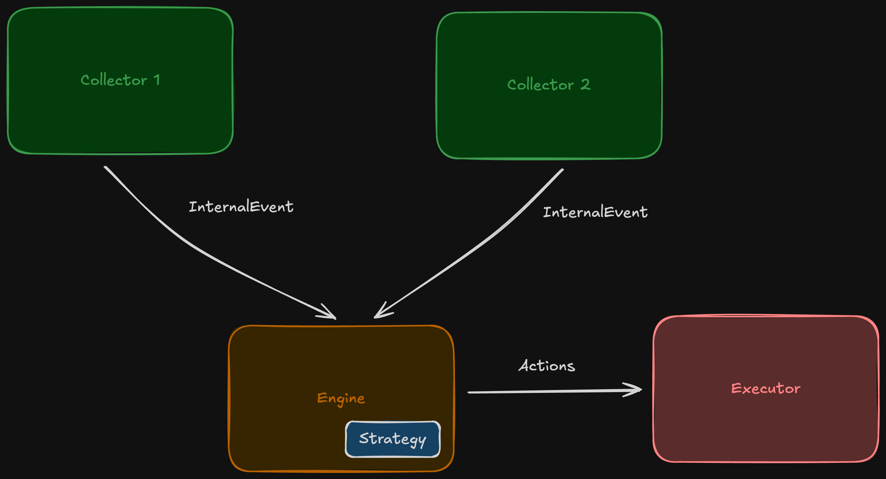

# Sikarra


A sophisticated Rust based arbitrage and marjet making system that monitors decentralized exhange (DEX) pools and centralized exchange (CEX) price feeds to identify tradin opportunities on **Base** Network.

## 🚀 Overview

The system is based on an even driven architecture.




## Core Components
- `sikkara-adapters`: Exchange adapters for CEX (Coinbase WebSocket) and DEX (Uniswap V4) integration
- `sikkara-bot`: Main bot logic
- `sikkara-core`: Shared utilities, engine framework, and common types
- `sikkara-wsclient`: WebSocket client infrastructure with reconnection and heartbeat

## 🛠️ Features

### Price Monitoring
- **Real-time CEX Data**: WebSocket connection to Coinbase Pro for live ETH/USDC pricing
- **On-chain DEX Data**: Direct integration with Uniswap V4 pool contracts on Base
- **High-precision Calculations**: Uses 512-bit decimal arithmetic for financial accuracy

### Arbitrage Detection
- **Cross-venue Price Comparison**: Identifies price discrepancies between CEX and DEX
- **Configurable Thresholds**: Set minimum profit percentages and absolute amounts
- **Directional Analysis**: Determines optimal buy/sell venue combinations

## Market Making Simulation
- Fair Value Reference: Uses CEX prices as baseline for range calculations
- Dynamic Spread Management: Adjusts spreads based on market volatility and conditions

## 🚦 Getting Started

### Prerequisites

- Rust 1.70+ with Cargo
- Access to Base network RPC endpoint
- Coinbase Pro WebSocket access

### Installation

```bash
# Install Cargo Maker For Easy
cargo install cargo-make

# Build the project
cargo make build-release

# Run tests
cargo test
```


### Running

```bash
# Start the bot
cargo run --bin sikarra-bot


# Enable debug logging
RUST_LOG=debug cargo run --bin sikarra-bot
```

- A default configuration is provided in `config` folder.
- It subscribes to `ETH-USDC` trading pair.
- Please note that events from CEX and DEX are only logged in debug mode. So if interested in seeing those events please turn on the DEBUG logs, as shown above


# FAQ

1. If you were to extend this to execute the identified arbitrage trades on
Base, what are the key challenges you would anticipate? How might
you mitigate some of these?

    - Bots monitoring mempool can see these arbitrage transactions
    - MEV bots can front run the trades
    - Gas wars with other arbitrage bots

    MEV can be mitigated by using private mempool and going via some trusted builder.


2. If you were to implement an actual market-making strategy on a DEX
like Aerodrome (which uses a ve(3,3) model) or Uniswap V4 on Base,
what are the primary differences and additional complexities
compared to a simple constant prduct AMM or a traditional order book ?

    Compared to a traditional orde book, the price changes on Uniswap V4 happens when liquidity is added/removed or swap transactions happen. However, traditional order book someone is responsible for providing liquidity by placing orders.

3. How would you manage the private keys and security of a bot like this
if it were trading real assets on Base?

    - Use secure enclaves like Intel SGX or AWS Nitro
    - Use dedicated HSM.


4. Describe the key components of a production-grade infrastructure for deploying and
running this trading bot reliably, considering it operates on an L2 like Base.
    - Would require multiple RPC bases nodes in different regions for latency concerns
    - Colocating with centralised exchanges like binance or coinbased for fast access to CEX data
    - Base sequencer redundancy - multiple connection path to Base network


5. What monitoring and alerting systems would you put in place for such a bot? What
key metrics would you track, including any L2-specific considerations?
    - Error metrics
    - Message dropping on channels in tasks if any
    - L2 finality tracking, making sure L2 state is finalized on L1
    - Gas price monitoring
    - Memory foot print

6. Outline a basic CI/CD pipeline for this Rust application.
    - Linting
    - Formatting
    - Testing
    - Benchmarking Test
    - Release Build
    - Deploying to lower envs and running test suite
